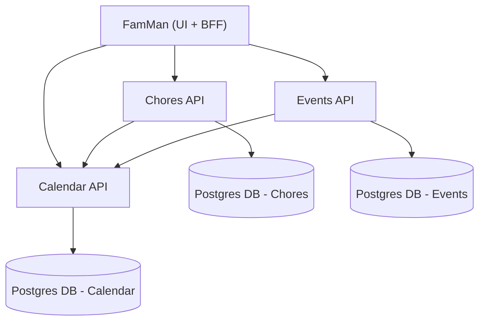

# FamMan Services Architecture

This document illustrates how the FamMan system and its services interact using a Mermaid diagram.

## Services Diagram

## FamMan (UI + BFF)

FamMan is a Blazor WebAssembly application with static server-side rendering. It provides a modern, interactive user interface for family management tasks. The Backend-for-Frontend (BFF) leverages YARP (Yet Another Reverse Proxy) to route requests to the correct microservice, ensuring secure and efficient communication between the UI and backend APIs.

- **Blazor WebAssembly** for rich client-side interactivity
- **Static server-side rendering** for fast initial loads and SEO
- **YARP-powered BFF** for intelligent request routing and security

## Chores API

The Chores API manages all aspects of family chores, including creation, assignment, and completion. When a chore is created or updated, the Chores API calls the Calendar API to add or update entries in the chores calendar, ensuring all tasks are visible and scheduled appropriately.

- Create, assign, and complete chores
- Integrates with Calendar API to schedule chores
- Stores data in a dedicated Postgres database

## Events API

The Events API is designed for managing typical calendar activities such as appointments, birthdays, holidays, and other family events. It provides endpoints for creating, updating, and viewing events, and interacts with the Calendar API to ensure all events are properly displayed and managed.

- Manage appointments, birthdays, holidays, and more
- Integrates with Calendar API for event display
- Stores data in a dedicated Postgres database

## Calendar API

The Calendar API is responsible for displaying and managing all events and chores that should appear on the family calendar. It offers both a RESTful API and ICAL support, making it easy to integrate with other calendar applications and services.

- Displays and manages calendar events and chores
- Provides REST API and ICAL support
- Stores data in a dedicated Postgres database
