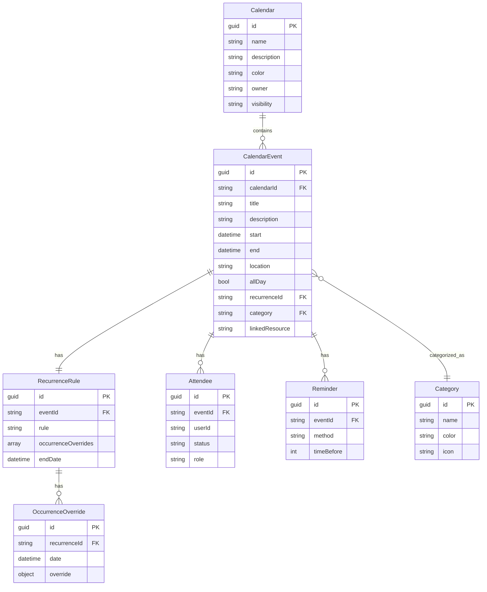

# Calendar API Core Resources

This document defines the main resources managed by the FamMan Calendar API. Each resource is described with its purpose and key properties.

---

## Occurrence Generation and JSON Output

FamMan Calendar API uses ical.net to generate event occurrences based on recurrence rules (RRULE). While ical.net is capable of producing ICAL output, the API returns occurrences as JSON objects for easier consumption by web and mobile clients.

Each occurrence is represented as a JSON object with key event details, such as start and end time, summary, and any overrides. This approach combines the robust recurrence logic of ical.net with the convenience of JSON APIs.

See the [Resource to ICAL Conversion](./5-ResourceToICAL.md) guide for mapping details and a JSON example.

### Entity Relationship Diagram (ERD)



#### Relationship Summary Table

| Entity         | Related Entity   | Relationship         | Cardinality         |
|----------------|-----------------|----------------------|---------------------|
| Calendar       | CalendarEvent   | contains             | 1 to many           |
| CalendarEvent  | RecurrenceRule  | has                  | 0 or 1 to 1         |
| RecurrenceRule | OccurrenceOverride | has                  | 0 or 1 to many      |
| CalendarEvent  | Attendee        | has                  | 0 or 1 to many      |
| CalendarEvent  | Reminder        | has                  | 0 or 1 to many      |
| CalendarEvent  | Category        | categorized_as       | many to 1 (optional)|


---

## Calendar

Represents a logical calendar (e.g., Family, Chores, Birthdays).

| Property      | Type     | Description                  |
|--------------|----------|------------------------------|
| id           | guid     | Unique identifier            |
| name         | string   | Calendar name                |
| description  | string   | Calendar description         |
| color        | string   | Display color                |
| owner        | string   | Owner user ID                |
| visibility   | string   | Public/private/shared        |

---

## CalendarEvent

Represents a scheduled item (appointment, chore, birthday, etc.).

| Property      | Type     | Description                  |
|--------------|----------|------------------------------|
| id           | guid     | Unique identifier            |
| calendarId   | string   | Parent calendar ID           |
| title        | string   | Event title                  |
| description  | string   | Event description            |
| start        | datetime | Start time                   |
| end          | datetime | End time                     |
| location     | string   | Event location               |
| allDay       | bool     | All-day event flag           |
| recurrenceId | string   | Recurrence rule ID           |
| category     | string   | Category/tag                 |
| linkedResource| string  | Linked domain object ID      |

---


## RecurrenceRule

Defines repeating patterns for events.

| Property              | Type     | Description                        |
|-----------------------|----------|------------------------------------|
| id                    | string   | Unique identifier                  |
| eventId               | string   | CalendarEvent ID                   |
| rule                  | string   | RRULE (RFC 5545) string            |
| occurrenceOverrides   | array    | List of occurrence override IDs    |
| endDate               | datetime | Recurrence end date                |

---


## OccurrenceOverride

Handles overrides or skips for specific occurrences of recurring events.

| Property      | Type     | Description                        |
|--------------|----------|------------------------------------|
| id           | guid     | Unique identifier                  |
| recurrenceId | string   | RecurrenceRule ID                  |
| date         | datetime | Date of the overridden occurrence  |
| override     | object   | Override details (optional)        |

---

## Attendee

Represents a participant in an event.

| Property      | Type     | Description                  |
|--------------|----------|------------------------------|
| id           | guid     | Unique identifier            |
| eventId      | string   | CalendarEvent ID             |
| userId       | string   | User ID                      |
| status       | string   | accepted/declined/tentative  |
| role         | string   | Role (organizer/participant) |

---

## Reminder

Notification settings for events.

| Property      | Type     | Description                  |
|--------------|----------|------------------------------|
| id           | guid     | Unique identifier            |
| eventId      | string   | CalendarEvent ID             |
| method       | string   | email/push/SMS               |
| timeBefore   | int      | Minutes before event         |

---

## Category

For filtering and organizing events.

| Property      | Type     | Description                  |
|--------------|----------|------------------------------|
| id           | guid     | Unique identifier            |
| name         | string   | Category name                |
| color        | string   | Display color                |
| icon         | string   | Icon name                    |

---

Example: CalendarEvent JSON

```json
{
  "id": "019b7b66-09cc-7365-b866-ac23d427f244",
  "calendarId": "019b7b66-09cc-7250-93af-531649f28275",
  "title": "Doctor Appointment",
  "description": "Annual checkup",
  "start": "2026-01-10T09:00:00Z",
  "end": "2026-01-10T10:00:00Z",
  "location": "Clinic",
  "allDay": false,
  "recurrenceId": "rr-1",
  "category": "Appointment",
  "linkedResource": null
}
```

## Relationships Overview

- **Calendar** contains multiple **CalendarEvents**.

- **CalendarEvent** may have:
  - One **RecurrenceRule** (for repeating events)
  - Multiple **Attendees** (participants)
  - Multiple **Reminders** (notifications)
  - One **Category** (for filtering/organization)
  - Zero or more **OccurrenceOverrides** (overrides/skips for recurring events)

- **RecurrenceRule** defines the pattern for event repetition and links to **OccurrenceOverride** for overrides.

- **OccurrenceOverride** modifies or skips specific occurrences of a recurring event.

---

## Example

A Calendar ("Family") contains a CalendarEvent ("Weekly Chore") with a RecurrenceRule ("Every Monday"). The event has Attendees (family members), Reminders (push notification), and a Category ("Chore"). If a specific Monday is skipped, an OccurrenceOverride is created for that date.

---

## Summary Table

| Resource         | Related To         | Relationship Type         |
|------------------|-------------------|--------------------------|
| Calendar         | CalendarEvent      | One-to-many              |
| CalendarEvent    | RecurrenceRule     | One-to-one (optional)    |
| CalendarEvent    | Attendee           | One-to-many              |
| CalendarEvent    | Reminder           | One-to-many              |
| CalendarEvent    | Category           | One-to-one (optional)    |
| RecurrenceRule   | OccurrenceOverride | One-to-many (optional)   |

---

See the [Mermaid Resource Diagram](./ResourceDiagram.md) for a visual overview.
